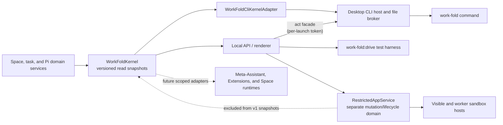

# work-fold management layer

work-fold now has a small management layer over its existing product model. It gives the renderer, command line, test harnesses, and future Assistant-facing adapters one semantic view of Spaces, running work, and Pi capabilities without creating another data store or agent framework.

This is infrastructure, not another navigation item. **work-fold**, **Space**, **Files**, **Chats**, **Library**, **History**, and **Assistant tools** remain the user-facing nouns. The management layer makes their underlying state inspectable in a consistent, versioned form.

## Why it exists

The desktop UI already knows how to work with Spaces and Pi, but a higher-level Assistant, an Extension, a script, or a future Space runtime also needs answers to basic questions:

- Which Space applies to this actor and working directory?
- Which Spaces are registered?
- Which Assistant turns or Chat compactions are still running?
- Which Skills, Extensions, tools, packages, prompts, themes, and commands are available in this Space, and what are their scope, source, trust, and load states?

Those answers should not be reimplemented by every consumer. `WorkFoldKernel` is the shared in-process read authority that produces them.



Domain services still own writes. The kernel does not bypass folder grants, registered-Space authorization, capability-mutation locks, History behavior, or any other mutation policy.

The dotted restricted-app edge is a boundary, not a data flow into the kernel. Space apps have their own reviewed package, grant, encrypted connection, storage, named-automation, notification, and sandbox-host state. Protocol v1 and `work-fold.capabilities` intentionally do not list or mutate that state. The machine-wide automation scheduler is an in-process execution coordinator for that domain, not a management-protocol mutation surface. Future app inventory belongs in a deliberately versioned kernel snapshot only after its content and authorization contract are designed.

## Kernel contract

`src/local/work-fold-kernel.ts` defines `workFoldKernelSnapshotVersion` and a normalized actor context:

```ts
interface WorkFoldActor {
  kind: "human" | "assistant" | "cli" | "renderer" | "extension" | "app" | "system";
  cwd?: string;
  spaceId?: string;
  conversationId?: string;
}
```

Space resolution is deterministic:

1. An explicit `spaceId` wins.
2. Otherwise, the most-specific registered Space whose root contains `cwd` wins. This matters when registered Space roots are nested.
3. Otherwise, the result has no Space context.

The current snapshot version is `1` and exposes four read models:

| Snapshot | What it contains |
|---|---|
| `work-fold.context` | Normalized actor, resolution method, and resolved Space or `null`. |
| `work-fold.spaces` | Registered Space identities, roots, ownership/location metadata, and timestamps. |
| `work-fold.tasks` | Running `assistant_turn` and `compaction` records, optionally scoped to one Space. |
| `work-fold.capabilities` | Pi's authoritative capability catalog plus packages, project authorization, mutation eligibility, provenance, and diagnostics for one Space. |

The local API and the desktop CLI share one kernel instance. Assistant turns and Chat compactions register a task when work is accepted and finish it in success and failure cleanup paths. Capability mutations remain blocked while affected work is active, so a catalog reload cannot silently terminate a background turn.

Capability snapshots are projections of Pi's native catalog. They do not create a second full-trust registry, activate inactive tools, bypass the Space registry, or install anything.

This contract belongs only to work-fold's new profile and `.work-fold/` data. The kernel and its adapters never parse or project a legacy Workspace registry or `.workspace/` manifest. Registering a folder that contains preserved `.workspace/` data creates a new work-fold Space identity instead of adopting the old one.

## work-fold CLI

The Windows installer places `work-fold.cmd`, an extensionless `work-fold` shim, and the private `work-fold-cli.ps1` helper in `<install>\bin`, then adds that directory to the current user's `PATH`. The Mac bundle places the extensionless shim and `work-fold-cli.jxa.js` under `work-fold.app/Contents/bin`; work-fold adds that directory to child-process `PATH` for Pi shell tools without editing a person's Terminal profile.

```powershell
work-fold context --json
work-fold spaces list
work-fold tasks list --space "Personal Space"
work-fold capabilities list --space "Personal Space" --json
work-fold version
work-fold help capabilities
```

`--space <id-or-exact-name>` selects a Space explicitly. Without it, Space-aware read commands resolve the terminal's current working directory. Duplicate exact names are rejected as ambiguous; use the stable Space id in automation. `--json` emits the stable protocol projection and is the preferred interface for scripts, Codex, Claude Code, and other shell-capable harnesses.

The read commands stay content-free: Space names and paths, task metadata, and capability metadata — no file contents, conversation text, credentials, or provider tokens.

The same command also carries the **act lane** — the separately versioned, per-launch-authenticated surface through which a shell-capable agent can operate the product while the work-fold app is running:

```powershell
work-fold chat create --space "Home"
work-fold chat send --space "Home" --new --message "File the material I dropped."
work-fold chat send --space "Home" --conversation <id> --message-file notes.md
work-fold chat status --space "Home" --task <task-id> --json
work-fold chat wait --space "Home" --task <task-id> --timeout 900 --json
work-fold chat result --space "Home" --conversation <id> --messages 5 --json
work-fold chat trace --space "Home" --task <task-id> --json
work-fold chat abort --space "Home" --conversation <id>
work-fold chats list --space "Home" --json
work-fold spaces create --name "Vendor Audits"
work-fold spaces register --path /Users/me/Projects/existing-folder
work-fold files add --space "Vendor Audits" --from ./report.pdf --to "Inbox" --json
work-fold manage send --message "File everything I dropped into the right Spaces."
work-fold manage send --message "Put this where it belongs and start a review." --attach ./report.pdf --attach https://example.com/owner/project
work-fold manage wait --task <task-id> --json
work-fold manage status --task <task-id> --json
work-fold manage stop --task <task-id> --json
```

`work-fold manage …` talks to the **management conversation** — user-facing name: **the fold** — the one conversation above all Spaces. It reuses the same acceptance path, Pi runtime, kernel task records, and task-scoped outcome semantics as Space Chats under the dedicated scope id `work-fold-management` instead of a Space id. Its transcript lives in machine-local application state under the app profile's `management/` root — it describes this machine's registry, so it is deliberately not portable Space data. Its Pi session loads personal-scope Skills and Extensions plus exactly two app-materialized project resources — a management `AGENTS.md` context file and the `manage-spaces` Skill, rewritten on every start — and gets no user Space's `.pi` configuration, no restricted-app bridges, and no History checkpoints (History is a Space concept).

Those two app-owned resources are required, not an optional enhancement. If work-fold cannot materialize them safely, ordinary Spaces and the desktop may still start, but management commands fail closed until the management folder can be prepared; work-fold never runs this full-trust scope as an unidentified, uninstructed Assistant.

Be precise about its authority: the management conversation is a **full-trust Assistant, taught rather than caged**. Like every work-fold Assistant it keeps Pi's ordinary read/bash/edit/write tools, which accept absolute paths anywhere this user can reach. The materialized instructions teach it to prefer the `work-fold` read and act commands for anything that touches Spaces — those carry the trust grants, restore points, receipts, and conflict rules — but that preference is instruction, not an enforced authority boundary. An enforced CLI-only management agent would be a different, deliberate design (per-session tool restriction) that this personal, local product has not adopted.

Without `--conversation`, manage commands target the most recent active management conversation, `manage send` creates it on first use, and `--new` deliberately allows additional threads while the default stays a single conversation; management turns appear in `work-fold tasks list` under the management scope id. The menu-bar and remote browser surfaces expose the same choice as **New chat**: the view becomes a clean slate immediately, the first send creates the new machine-local transcript, and the previous transcript remains saved rather than being cleared or rewritten.

### Management attachments, request lineage, and the popover surface

`manage send --attach <path-or-link>` (repeatable, at most 16) attaches **references, not copies**: absolute or cwd-relative file and folder paths, or http(s) links. A Space Chat stages dropped material inside the Space because Space transcripts are portable; the management transcript is deliberately machine-local, so its attachments carry absolute paths, missing sources are refused at send time, and the only copy in the flow stays the restore-pointed `files add` into a destination Space. Readable files inline into the turn within the shared context budget; folders, binaries, and oversized files stay honest path-only references; links arrive as a typed list, never as fake files. The typed references persist on the management user message, and `--attach` rides in ordinary act argv — act protocol v2's envelope and payload are unchanged.

Every accepted management turn is a **request**. Its hidden turn context supplies that request's task id, and the app-owned instructions require `--parent-task <id>` on `chat.send`, `files.add`, `spaces.create`, and `spaces.register`. The act host validates that explicit parent while it is active before journaling or running the mutation; attributed actions become the request's action trail, delegated turns become its children, and act receipts gain the same `parentTaskId`. An unrelated same-user CLI action is therefore never credited merely because one management turn happens to be running, and concurrent management turns remain unambiguous. This is lineage, not a new caller-authentication boundary: the act token still has the documented same-user posture. The rich request projection — attachment dispositions, actions, and child lineage — is in-memory for the app run. Transcripts and act receipts remain its long-lived records, while the bounded machine-local turn journal preserves acceptance identity, stream checkpoints, and recent terminal outcomes across app restarts.

`manage status --task` therefore reports a `request` object alongside the turn: per-attachment **dispositions** computed from recorded actions (`placed`, `registered`, or honestly `unrecorded`), recorded actions with restore-point ids, child turns with their own task states, the reply, and a **phase** — `working`, `needs_you` (the reply's final line asks a question), `handed_off` (the management turn finished but a delegated Space turn still runs), `done`, `failed`, or `stopped`. Done requires both the management turn and every child to succeed; a failed or lost child fails the request, and an aborted child or accepted request-level stop stays stopped. A popover reply to `needs_you` starts a fresh turn in the same conversation while carrying the prior request's attachments and action/child trail forward; it does not replay those attachments into model context. `manage stop --task` aborts the management turn and every recorded child turn still running, and names each turn it touched.

The same request model backs the desktop's **menu-bar popover** (macOS menu-bar item; the Windows tray gains the same "Your fold" entry), which talks to `/api/management/*` local-API routes — send with attachments, summary, request status, request stop, transcript, and the per-conversation event stream — through the same acceptance path, conflict rules, and kernel task records as every other surface. The popover is deliberately a window, not a tab, so the Space-bound tab contract is untouched; dropping onto the macOS menu-bar icon or the popover stages bounded references without sending anything, and the send is always an explicit act. Its sandboxed renderer has a dedicated preload exposing only the local API session, dropped-file path resolution, hide/show-main actions, and window material — it does not inherit the main renderer's folder, restricted-app, update, settings, or shell bridges.

### Remote browser surface

Server-enabled private-alpha Remote access adds a browser surface to the canonical management
conversation; it does not add another Assistant, transcript, Pi session, or Space-chat mode. The
desktop renderer configures a unique address and password in Settings. A
server-side switch controls whether new addresses may be created; the public
desktop app carries no shared enrollment credential, and the bridge applies
per-IP and global enrollment rate limits. A
successful password check creates only a host-only, SameSite session. A new
browser then creates non-exportable P-256 signing and agreement keys plus a
fresh pairing id. The browser and desktop independently derive the matching
six-digit code from that id, the browser identity, and both public keys; a code
supplied by the relay is never authoritative. Approval creates a
desktop-signed, generation-bound browser grant. One browser, every browser, the
whole connection, and the address itself are separately revocable from the
desktop.

The public bridge terminates HTTPS and WebSockets and the hosted origin serves
the executable browser client. PostgreSQL durably stores the address and scrypt
verifier, device and browser public keys, grant certificates and generations,
hashed sessions, and bounded operation metadata. It does not store private keys.
Browser requests and desktop results use signed ECDH/HKDF/AES-GCM envelopes;
completed prompt, transcript, result, Space-name, and file-tree bodies are not
written to the database. This application encryption protects passive handling
and persisted relay state, not an actively compromised hosted origin: same-origin
code can use an approved non-exportable browser key, so the hosted client and
bridge are trusted authority in this alpha even though the desktop remains the
local execution endpoint. Live bounded encrypted response buffers, browser
event streams, desktop presence, and rate limits are process-local, so the
service must stay at one replica until those functions move to a shared
backplane. Scheduled cleanup, active-row expiry predicates, per-grant operation
caps, SSE caps, per-client queued-byte limits, and a global ciphertext-byte
budget bound the current process. Device protocol errors have a finite
per-connection budget and are terminal when received, while unknown typed
frames are ignored for forward compatibility. Structured aggregate metrics
cover request rate, password-check admission, device frame rate, event-loop
lag, connection counts, and the enrollment switch without recording ids,
content, ciphertext, tokens, addresses, or network identifiers.

The desktop does not expose its renderer token or tunnel arbitrary local HTTP.
`WorkFoldRemoteFacade` is a closed semantic adapter with bounded saved-Chat
listing, summary/transcript/rename/send/stop operations for the management conversation,
management request projection, Space-name listing, and bounded Space-relative
tree projection. It strips absolute roots and attachment target paths, applies
the ordinary ignore policy to tree views, rejects traversal and unknown fields,
and rechecks the locally encrypted grant immediately before execution.
Dispatch and desktop-local authority mutations share one serialization fence;
revocation removes local authority before contacting the bridge and stops
locally tracked management requests and their recorded delegated children.
Every local and bridge cleanup lane is attempted even if another fails, and
address removal keeps the device credential until server deletion is confirmed
or the server confirms that the account is already absent. Grant-scoped signed
request ids, atomic bridge delivery claims, desktop in-flight claims, and
exact-id recovery prevent a reconnect or bridge restart from inventing a second
prompt. A late signed result may complete an operation marked lost across a
socket replacement, and repeated increasing progress events remain valid.
`management.send` enters `acceptConversationTurn`, may explicitly
start a new saved thread, persist `remote_web` browser/grant provenance and a
signed request id, and participate in the same active-turn, stop, transcript, and Pi-session
rules as the desktop management surface. `management.rename` records the same
provenance on an append-only manual-title event, is retry-idempotent within that
exact browser grant, and refuses to race an active turn or Chat compaction. Each
accepted remote request records
both its browser identity and exact grant. Direct task-scoped request status and
stop calls reject every other browser or replacement grant, and cross-grant
summaries omit task ids and action details. That direct-adapter ownership check
is not hostile-browser isolation: every approved browser can prompt the same
full-trust management Assistant within the personal single-user trust boundary.
Space work is initiated only when that
Assistant uses the attributed act path; delegated children then use the target
Space's registered runtime authorization, native Pi project resources and tools,
and pre/post-turn History path. The Files selector is observational and never
changes the conversation target. The
stable kernel continues to classify it as a renderer surface; the durable
message/request provenance distinguishes remote acceptance without changing
the version-1 actor vocabulary. Current replay records require the exact
browser, grant, and signed request id. Shipped 0.2.2 records, which predate the
grant field, retain browser-and-request recovery compatibility. A bounded
filesystem-verified derived index accelerates this lookup without replacing the
append-only transcripts as authority; oversized stores fall back to the full
authoritative scan.

Remote file upload is bounded to six plain-named files, 6 MB each and 8 MB per
message, carried inside the encrypted request envelope. Uploads are temporary
management references under app-owned `management/Incoming/Remote/`: at most
64 MB is retained, request directories expire after 24 hours, revoking a browser
purges that browser's directory, and disabling Remote access purges the whole
staging root. The management Assistant can use them there or place them into a
Space through the ordinary restore-pointed `files add` act. Remote results
expose names and sizes, never staging paths.

This is a powerful full-trust Assistant surface. Pairing authorizes a browser
to ask the taught-but-not-tool-restricted management Assistant to act with the
local user's authority while the desktop is online, including delegating to a
Space Assistant. Password possession alone is not that grant, and an offline
desktop cannot approve or execute anything.

The closed remote operation vocabulary grows with the fold's decision and glance surfaces: `decisions.list` and `decisions.decide` present pending staged acts as live projections and carry a person's approval or denial, and `management.glance`/`management.glanceSeen` return the deterministic digest and advance that grant's own last-seen marker — same signed envelopes, same effect-time grant recheck, no new persisted content classes at the bridge. Decision receipts record the approving browser and exact grant; a staged act is never decidable from the remote grant whose request staged it, and Personal-scope make-runnable decisions are desktop-only; revoking a browser refuses its in-flight decision operations before consumption, cancels the pending staged acts its grant staged, and deletes its glance marker. Published viewer pages are a different plane entirely: viewer traffic terminates on separate `pages-` origins, never appears in the management operation allowlist, and never reaches these operations.

Space-targeted act commands never resolve a Space from the working directory — every write names its Space explicitly. `chat send` accepts a CLI-initiated Assistant turn through the exact same acceptance path as the renderer (conflict checks, stable request identity, durable acceptance before transcript append, kernel task record with a `cli` actor, portable transcript persistence, pre/post-turn History checkpoints) and returns a task id. The act-envelope request id is the turn's idempotency key, so an uncertain delivery cannot create a second Assistant run. Terminal failures and explicit stops append a typed, sanitized Assistant result before the task settles, including setup failures that occur before a provider can answer; that same durable rule covers the machine-local management transcript and menu-bar popover, while raw provider diagnostics stay host-side. That task id is how a caller follows exactly its own turn: work-fold keeps recent terminal outcomes (`succeeded`, `failed`, or `aborted`, with the persisted response message id or failure message) in a bounded machine-local journal across app restarts. `chat status --task`/`chat result --task` read it, and `chat wait --task` is a shim-side poll that finishes with that turn's own result — a failed or aborted turn exits non-zero instead of presenting an older transcript message as success (wait timeout exit code 7). `chat trace --task` reads the full Pi session entries that turn appended straight from Pi's own durable session log (reasoning, complete tool call arguments/results, token usage and cost, retry diagnostics, timestamps) — none of it goes through the coarse, truncated summaries the Chat UI shows; only likely secrets are redacted. It resolves the turn's exact entry range from two session leaf ids recorded at `settle()` time, so it works for any turn recorded after this feature shipped, including turns whose Chat UI activity log has long since reset; a turn recorded before this feature existed returns `available: false`. On startup, an accepted turn that reached its transcript but never settled is recorded as interrupted and is not automatically rerun, because completed tools may already have changed something. `chat status|result --conversation` remain the transcript-scoped views. `files add` copies outside material in with a targeted restore point that succeeds or fails together with the placement, and `spaces create`/`spaces register` grant the same registered-Space runtime authorization as the desktop actions. Content-bearing chat reads (`chat status|result`, `chats list`) belong to the act lane too, so the read lane keeps its content-free property. When the interactive app is not running, act commands fail fast with "Open work-fold…" and exit code 6.

Optional Checks reuse this split instead of creating another management plane. `checks status` is the only read-lane Check command and emits aggregate counts/state only. Its experimental summary distinguishes enabled Checks that have `neverRun` from previously computed results whose inputs are `stale`; either keeps the Space-level state stale until a requested run establishes current evidence. `checks enable|disable|run|task|result|abort|problems|decide` use the act lane, require an explicit Space, and receive the same journal-first at-most-once receipts. `checks wait` is a shim-side task poll like Chat wait. Portable `.work-fold/checks/*.json` declarations are inert and registration never enables them; authority is an exact-digest machine record. Every run starts an internal kernel `check_run` task and participates in capability-mutation fencing, but the experimental task kind is deliberately filtered from stable `work-fold tasks` protocol v1 until its compatibility contract is promoted. Runs are manual, globally bounded across all selected Checks, and receive a host-resolved closed input projection rather than ambient filesystem authority. Status computes freshness from runner-owned input identities and never executes sensor/provider logic. See [Checks](checks.md).

## Desktop handoff

The public command does not run Electron as Node; the `RunAsNode` fuse remains disabled. Instead it uses a bounded protocol-v1 file handoff:

1. The shim writes an atomic UUID-named request beneath the owning app's platform profile containing the arguments, current working directory, protocol version, and timestamp. An installed production app uses `%APPDATA%\work-fold\cli\requests` on Windows or `~/Library/Application Support/work-fold/cli/requests` on macOS. An uninstalled Windows package uses `%APPDATA%\work-fold Development\cli\requests`, and the separately identified Mac smoke app uses its own product directory. Packaged child commands receive that exact root through the CLI-only `WORKFOLD_CLI_STATE_DIR`; desktop state selection never reads it.
2. It starts or contacts the exact installed Windows executable or Mac app executable with that request id. Electron's single-instance handoff routes the request to the existing desktop host when the app is already open.
3. The desktop host claims and serializes the request, executes it through `WorkFoldCliKernelAdapter`, and atomically writes stdout, stderr, structured result, and exit code beneath `responses`.
4. The shim returns that output and removes its request and response files. The broker also removes stale bounded files during initialization.

A CLI-only launch can initialize the host, process its queue, flush Pi state, and exit without showing the interactive window. If the GUI is already running, the command uses the same kernel and live task registry as the renderer.

The broker rejects unsafe roots, symbolic-link or non-regular request files, path escapes, oversized payloads, stale timestamps, future clock skew, duplicate claims, and unsupported fields. These checks make the handoff bounded; they do not authenticate the caller.

## Security boundary

The platform CLI directory is a same-operating-system-user coordination channel, not a public API or authenticated caller boundary. Another process running as the same user may be able to submit requests and read the resulting local metadata. Protocol v1 therefore remains read-only; mutations are never added to it.

The act lane is the separately versioned write surface (`src/local/cli/act-protocol.ts`, protocol version 2) that satisfies the requirements a write surface was always going to need — in the smallest form that is honest for a personal, local product:

- **Per-launch request authentication.** The interactive app mints a random act token every run, writes it to `cli/act-token.json` (0600 on POSIX; Windows relies on the profile directory's ACLs), and removes it on shutdown. Shims attach the token to each act request; the desktop host compares it in constant time. On a single-account machine the OS user is the principal — the token binds requests to *this app run* and keeps stale or crash-residue requests inert; it does not pretend to distinguish same-user callers.
- **Freshness and at-most-once execution.** Act requests reuse the broker's bounded, atomic, freshness-checked claim path; a pending request id returns its recorded response, and after the shim cleans those files up, the journal's `accepted` records refuse a duplicated id outright instead of re-executing the mutation. The broker refuses requests older than its freshness window, and journal rotation holds entries at least that long, so the two windows compose into a durable at-most-once guarantee.
- **Explicit scope.** Every act command names its Space; there is no working-directory resolution for writes. Chat commands additionally name their conversation or task.
- **Journal-first receipts.** Every authorized act command appends an `accepted` line to `cli/receipts/act.jsonl` **before** its mutation runs — an unwritable journal refuses the command — and a terminal `ok`/`error` line after (timestamp, command, Space/conversation ids, outcome, error code, History checkpoint id, kernel task id). Receipts additionally record the initiating surface (`cli`, `popover`, or `remote_web` with browser and grant ids), the decision id and deciding surface for consecrated acts, the standing-policy id when a policy rather than a click satisfied a decision, and a typed prior-state reference for undo — identifiers and digests only, never content. A crash can separate the pair, but an applied action can never be missing its `accepted` trace; a missing terminal record is itself the honest signal that the outcome was interrupted. Terminal-record failures surface as a warning on the command's stderr.
- **Existing policy checks.** Act execution happens through an in-process facade the interactive local API exposes on its handle, reusing the same route internals as the renderer — registered-Space trust grants, capability-mutation locks, turn-conflict rejection, History checkpoints, and kernel task records included. Without the running interactive app there is no facade and nothing mutates.
- **Staged decisions.** Acts in the three consecrated families — make bytes runnable, widen a standing power, destroy irreversibly — stage a fully prepared, inert pending decision instead of executing. The decision path exists only on the desktop renderer surfaces and an approved remote browser's signed envelope; the act facade never exposes decision or policy-mutation internals, so no act-lane request can approve anything. Approval rechecks every pinned identity, is consumed journal-first under a deterministic decision request id, executes as a fenced kernel task, and is never auto-retried on failure; startup marks an interrupted execution and never replays it.

Chat-scoped authorization (a token that may only touch one Chat), confirmation ceremonies, and revocation of individual grants remain future work for any surface that outgrows the personal single-user boundary.

## Agent harness versus management CLI

The management CLI inspects the running product. `work-fold:drive` serves a different purpose: it runs one real Pi turn through the same local API, built-in tools, Skills, Extensions, persistence, and event stream as the desktop app.

```powershell
npm run work-fold:drive -- --space-root C:\path\to\space --prompt "Summarize the files in this Space"
npm run work-fold:drive -- --space-root C:\path\to\space --prompt "..." --json --agent-dir C:\temp\isolated-pi
npm run work-fold:drive -- --space-id <id> --attach http://127.0.0.1:4327 --prompt "..."
```

Useful options include `--prompt-file`, repeatable `--context`, `--conversation`, `--attach`, `--agent-dir`, `--timeout`, `--json`, and `--quiet`. In-process runs use temporary work-fold application state unless `WORKFOLD_STATE_DIR` is set. Provider credentials still come from Pi auth storage or standard provider environment variables.

Use the CLI to assert management snapshots. Use `work-fold:drive` to test actual Assistant behavior end to end.

`work-fold:appearance` is a third, deliberately inert development primitive. It creates and validates
a bounded Space-appearance proposal that Codex or Claude Code can hand to a person for import in the
frontend. It does not contact the running product or mutate state, so it is not a protocol-v1 command
and does not weaken the authenticated-mutation requirements below. See
[Space customization](space-customization.md).

## Direction, not shipped authority

This read-only layer is the first primitive for a broader work-fold operating layer. It can support a future cross-Space Assistant and controlled Space runtimes because they can start from one semantic inventory instead of scraping UI state.

The renderer capability catalog now also carries validated declarative surface metadata from Extensions Pi actually loaded. The compact installed CLI projection remains content-free and does not emit surface block contents or mutate UI state.

Separately, the local restricted-app service can inspect and install completed reviewed web assets without evaluation, and the desktop can mount or invoke them through the sandbox hosts. Package dependency metadata is never resolved or installed. Restricted apps remain outside the kernel and CLI projection and must never be merged into Pi's loaded Extension catalog. See [Restricted app runtime](restricted-app-runtime.md).

It does **not** yet provide:

- a headless act lane (act commands need the running interactive app; the turn runtime lives there);
- Chat-scoped or revocable per-grant authorization beyond the per-launch act token;
- a tool-restricted or independently permissioned cross-Space meta-Assistant beyond the current full-trust, taught management conversation;
- event subscriptions for all state changes;
- imperative APIs for full-trust Pi Extensions to dynamically create or mutate rail items, panes, or tabs beyond the static `surface.json` contribution contract (restricted Space apps already have their separate host-owned navigator and tab bridge);
- a verified registry that binds a Space-local service to a work-fold-launched process generation;
- host-owned remote subscriptions or arbitrary push adapters for restricted
  apps (static reviewed automation notifications are already supported);
- resource isolation comparable to a mobile operating system; the shipped Chromium hosts and brokers do not eliminate renderer exploits or CPU/memory denial-of-service risk.

Restricted apps already have an explicit package, permission, lifecycle, sandbox-host, connection, storage, file-grant, named-automation, run-receipt, and UI-surface model. The remaining features should extend those contracts and the kernel's read authority instead of reaching around either boundary.

## Implementation and verification map

| Area | Source | Primary tests |
|---|---|---|
| Versioned snapshots and context resolution | `src/local/work-fold-kernel.ts` | `tests/work-fold-kernel.test.ts` |
| Compact CLI projection | `src/local/work-fold-cli-adapter.ts` | `tests/work-fold-cli-adapter.test.ts` |
| Protocol, parsing, output, and exit codes | `src/local/cli/protocol.ts`, `src/local/cli/commands.ts` | `tests/work-fold-cli-protocol.test.ts` |
| Act request schema and envelope dispatch | `src/local/cli/act-protocol.ts` | `tests/work-fold-cli-act-protocol.test.ts` |
| Per-launch act token file | `src/local/cli/act-token.ts` | `tests/work-fold-cli-act-token.test.ts` |
| Act receipts | `src/local/cli/act-receipts.ts` | `tests/work-fold-cli-act-receipts.test.ts` |
| Act argv parsing and executor | `src/local/cli/act-commands.ts` | `tests/work-fold-cli-act-protocol.test.ts`, `tests/desktop-work-fold-cli-host.test.ts` |
| Act facade over route internals | `src/local/server.ts`, `src/local/cli/act-facade.ts` | `tests/work-fold-act-facade.test.ts` |
| Atomic bounded file broker | `src/local/cli/broker.ts` | `tests/work-fold-cli-broker.test.ts` |
| Electron single-instance host | `desktop/src/work-fold-cli-host.ts`, `desktop/src/main.ts` | `tests/desktop-work-fold-cli-host.test.ts` |
| Installer shims and PATH integration | `desktop/cli/`, `desktop/nsis/cli-path.nsh` | `tests/desktop-cli-packaging.test.ts` |
| Real Pi turn driver | `scripts/work-fold-drive.ts` | Exercised against the local API when provider credentials are available. |
| Restricted app review, grants, lifecycle, and storage | `src/local/agent/restricted-app-*.ts` | `tests/restricted-app-*.test.ts` |
| Machine-wide restricted-app automation scheduling | `src/local/agent/work-fold-automation-service.ts` | `tests/work-fold-automation-service.test.ts` plus restricted-app service/API tests |
| Staged acts and the decision path | `src/local/fold-staged-acts.ts`, `src/local/fold-decisions.ts` | `tests/fold-staged-acts.test.ts`, `tests/fold-decisions.test.ts` |
| Standing policies | `src/local/fold-policies.ts` | `tests/fold-policies.test.ts` |
| Routing declarations, store, settle signals, and executor | `src/local/routings/` | `tests/work-fold-routing-declarations.test.ts`, `tests/work-fold-routing-store.test.ts`, `tests/work-fold-routing-settle-signal.test.ts`, `tests/work-fold-routing-service.test.ts` |
| Glance composition and seen markers | `src/local/glance.ts`, `src/local/glance-seen-store.ts` | `tests/work-fold-glance.test.ts`, `tests/work-fold-glance-seen-store.test.ts` |
| Publications and viewer serving | `src/local/publications.ts`, `desktop/src/remote-access.ts` | `tests/work-fold-publications.test.ts`, `tests/desktop-remote-access.test.ts` |
| Visible and worker sandbox hosts | `desktop/src/restricted-app-host.ts`, `desktop/src/restricted-app-preload.cts` | `npm run desktop:restricted-app:smoke` plus focused host/broker tests. |

See [Architecture](architecture.md) for the surrounding process boundaries, [Product model](product-model.md) for the user-facing mental model, and [Windows build](windows-build.md) for packaging and release verification.
